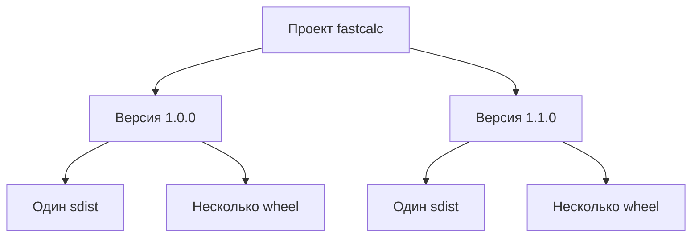
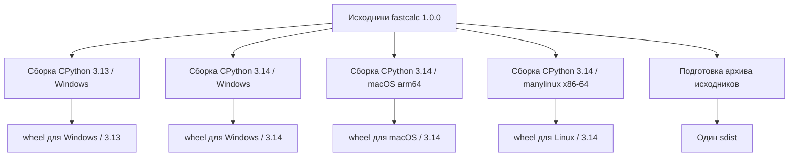
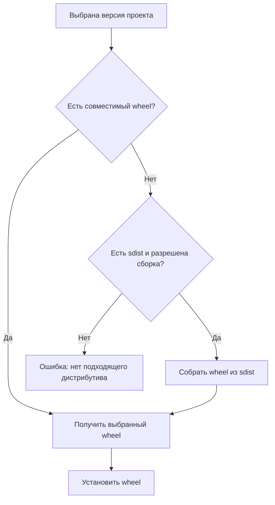

# Несколько wheel и sdist: файлы одного проекта

## 1. Проект, версия, файлы

У проекта может быть несколько версий. У каждой версии обычно один sdist
и один или несколько wheel. Несколько wheel одного релиза — варианты
установки одной версии для разных окружений.



`fastcalc` далее — условный проект с расширением на C. Примеры файлов
иллюстрируют правила, а не содержимое конкретного проекта на PyPI.

## 2. Зачем несколько wheel

Расширение на C компилируется под определённое окружение. Машинный код для
Windows x86-64 не подходит для macOS arm64. Совместимость с Python также
зависит от интерфейса, с которым собрано расширение.

Для версии `1.0.0` автор подготовил:

```text
fastcalc-1.0.0.tar.gz
fastcalc-1.0.0-cp313-cp313-win_amd64.whl
fastcalc-1.0.0-cp314-cp314-win_amd64.whl
fastcalc-1.0.0-cp314-cp314-macosx_15_0_arm64.whl
fastcalc-1.0.0-cp314-cp314-manylinux_2_28_x86_64.whl
```

| Файл / окончание имени | Назначение |
|---|---|
| `.tar.gz` | Исходники релиза для сборки |
| `cp313-cp313-win_amd64.whl` | Обычная сборка CPython 3.13, Windows x86-64 |
| `cp314-cp314-win_amd64.whl` | Обычная сборка CPython 3.14, Windows x86-64 |
| `cp314-cp314-macosx_15_0_arm64.whl` | Обычная сборка CPython 3.14, macOS 15+, arm64 |
| `cp314-cp314-manylinux_2_28_x86_64.whl` | Обычная сборка CPython 3.14, совместимый Linux с glibc 2.28+, x86-64 |

Обычная сборка CPython здесь означает сборку с GIL. У free-threaded CPython
другие требования к ABI. Тег `manylinux` относится к Linux с glibc;
он не означает совместимость с любым Linux, в частности с musl.
[Теги совместимости](https://packaging.python.org/en/latest/specifications/platform-compatibility-tags/).

Автор собирает эти варианты в подходящих средах, часто через матрицу CI.
Один запуск сборки на ноутбуке не создаёт автоматически все варианты.



Sdist обычно общий для платформ: он содержит исходники, а платформенные
различия учитываются при сборке. Его наличие не гарантирует, что код можно
собрать на любой ОС. Проект может требовать определённую систему, компилятор
или внешнюю библиотеку. [Назначение форматов](https://packaging.python.org/en/latest/discussions/package-formats/).

## 3. Как выбирается файл

Зафиксируем версию: `fastcalc==1.0.0`. Предположим, её `Requires-Python`
допускает Python 3.13 и 3.14; зависимости разрешаются успешно, а сборка
из исходников разрешена. Рассматриваем только файлы из раздела 2.

| Окружение пользователя | Результат выбора |
|---|---|
| CPython 3.13, Windows x86-64 | Wheel с `cp313-cp313-win_amd64` |
| CPython 3.14, Windows x86-64 | Wheel с `cp314-cp314-win_amd64` |
| CPython 3.14, macOS 15, arm64 | Wheel с `cp314-cp314-macosx_15_0_arm64` |
| CPython 3.14, Linux x86-64, glibc 2.35 | Wheel с `cp314-cp314-manylinux_2_28_x86_64` |
| CPython 3.14, macOS 15, Intel x86-64 | Подходящего wheel нет: попытка сборки из sdist |
| CPython 3.13, macOS 15, arm64 | Подходящего wheel нет: попытка сборки из sdist |

Установщик выбирает подходящий файл, а не скачивает все wheel релиза.
Если выбран sdist, из него сначала собирается wheel, который затем
устанавливается в окружение. Если сборка завершилась ошибкой, установка
не завершится успешно. [Этапы установки pip](https://pip.pypa.io/en/stable/cli/pip_install/).



## 4. Почему у нашего пакета один wheel

`seminar-text-tools` содержит Python-код без бинарных расширений:

```text
seminar_text_tools-0.1.0.tar.gz
seminar_text_tools-0.1.0-py3-none-any.whl
```

`py3-none-any` не привязан к конкретному ABI или платформе. Отдельные wheel
для Windows, Linux и macOS нашему примеру не нужны. Однако метаданные
`Requires-Python: >=3.14` ограничивают версию Python: на 3.13 пакет
не устанавливается, даже если тег начинается с `py3`.

При установке из sdist ограничение версии Python тоже действует.
Сборка из исходников не превращает неподдерживаемый Python в поддерживаемый.

## 5. Может ли один бинарный wheel подходить нескольким Python

Да. Если расширение использует Stable ABI CPython, возможен, например,
такой условный файл:

```text
fastcalc-1.0.0-cp310-abi3-win_amd64.whl
```

Он может подходить обычным сборкам CPython начиная с 3.10 на Windows x86-64,
если метаданные проекта не вводят дополнительных ограничений. `abi3`
обозначает использование стабильного ABI. Это свойство способа сборки
расширения; одной замены имени файла недостаточно.

Для окружения могут подходить несколько тегов. Установщик учитывает порядок
предпочтения совместимых тегов, а не требует буквального совпадения номера
Python в каждом имени. [Спецификация тегов](https://packaging.python.org/en/latest/specifications/platform-compatibility-tags/).

## 6. Что меняется, когда доступны несколько версий

Пусть для одной платформы доступны:

```text
fastcalc-1.0.0-cp314-cp314-win_amd64.whl
fastcalc-1.0.0.tar.gz
fastcalc-1.1.0.tar.gz
```

Если ограничения допускают `1.1.0`, обычный выбор pip может привести к сборке
более новой версии из sdist. Наличие wheel старой версии не означает,
что установщик обязательно выберет её.

| Запрос pip | Результат при указанных файлах и совместимых метаданных |
|---|---|
| `fastcalc==1.0.0` | Установка wheel версии 1.0.0 |
| `fastcalc==1.1.0` | Сборка версии 1.1.0 из sdist |
| `--only-binary=:all: fastcalc==1.1.0` | Ошибка: сборка из исходников запрещена, wheel отсутствует |
| `--prefer-binary fastcalc` | Предпочтение доступному совместимому wheel, даже если sdist новее |

Существующее окружение, ограничения зависимостей и флаги влияют на выбор.
Для точного сравнения файлов удобно фиксировать версию и использовать
чистое окружение. [Параметры выбора pip](https://pip.pypa.io/en/stable/cli/pip_install/).

## 7. Что означает «несколько sdist»

Если в индексе видны `fastcalc-1.0.0.tar.gz` и `fastcalc-1.1.0.tar.gz`,
это исходники двух разных релизов. Для одного современного релиза обычно
создают один sdist, из которого можно получить несколько wheel.

В локальном `dist/` могут остаться архивы прежних сборок. Команда сборки
не означает, что любой файл в этой папке относится к текущей версии.
При установке указывайте нужный файл явно.

В нашем примере `uv build` по умолчанию создаёт sdist, а затем собирает из
него wheel. Результат — два файла одной версии, а не два устанавливаемых
пакета. [Сборка дистрибутивов uv](https://docs.astral.sh/uv/concepts/projects/build/).
