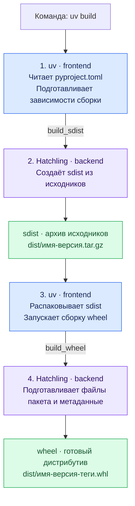

# Термины: packaging

| Термин | Определение |
|---|---|
| Модуль | Единица организации Python-кода с собственным пространством имён. |
| Импортируемый пакет | Модуль, который может содержать подмодули и подпакеты. |
| Дистрибутив | Единица распространения и установки проекта с именем, версией, файлами и метаданными. |
| Релиз | Опубликованная версия проекта. |
| Packaging | Подготовка кода и метаданных проекта для распространения и установки. |
| PyPA — Python Packaging Authority | Рабочая группа, поддерживающая инструменты, спецификации и документацию упаковки Python. |
| PyPI — Python Package Index | Публичный индекс Python-проектов с метаданными релизов и файлами дистрибутивов. |
| pip | Установщик Python-пакетов. |
| uv | Инструмент управления Python, окружениями, зависимостями, сборкой и публикацией проектов. |
| PEP — Python Enhancement Proposal | Документ, описывающий предложение, спецификацию или процесс развития Python. |
| Build frontend | Инструмент, принимающий команду сборки, подготавливающий сборочную среду и вызывающий build backend. |
| Build backend | Компонент, который по запросу frontend обрабатывает исходники и метаданные проекта и создаёт wheel или sdist. |
| Install frontend | Инструмент, устанавливающий дистрибутивы и их зависимости в целевое окружение. |
| Hatchling | Сборочный backend, создающий wheel и sdist из исходников и конфигурации проекта; предоставляет интерфейс `hatchling.build`. |
| Сборка | Преобразование исходников и метаданных проекта в файлы дистрибутивов. |
| sdist — source distribution | Архив исходников и метаданных релиза, предназначенный для последующей сборки. |
| wheel | Готовый к установке дистрибутив: ZIP-архив с расширением `.whl`. |
| Метаданные | Сведения о проекте: имя, версия, требования к Python, зависимости и другие характеристики. |
| `pyproject.toml` | Файл метаданных проекта, описания системы сборки и настроек инструментов. |
| Runtime-зависимости | Пакеты, необходимые для работы установленного проекта. |
| Зависимости сборки | Пакеты, необходимые для создания дистрибутивов. |
| Dev-зависимости | Пакеты, необходимые для разработки и проверки проекта. |
| Виртуальное окружение | Изолированное окружение Python со своим набором установленных пакетов. |
| Build isolation | Выполнение сборки в отдельной среде с объявленными зависимостями сборки. |
| Установка | Размещение файлов дистрибутива и регистрация его метаданных в целевом окружении. |
| Editable install | Установка, связывающая окружение с рабочими исходниками проекта. |
| Публикация | Загрузка файлов дистрибутива и метаданных релиза в индекс пакетов. |
| Импорт | Получение модуля через систему импорта Python с загрузкой и инициализацией при необходимости. |
| `site-packages` | Каталог установленных сторонних Python-модулей, пакетов и метаданных. |
| Entry point | Запись метаданных, связывающая имя с объектом Python. |
| Console script | Entry point, по которому установщик создаёт консольную команду. |
| ABI — Application Binary Interface | Бинарный интерфейс: правила вызова функций, передачи аргументов и представления данных, определяющие совместимость скомпилированных компонентов. |
| GIL — Global Interpreter Lock | Блокировка интерпретатора CPython, при включении которой только один поток одновременно исполняет Python-байткод в данном интерпретаторе. |
| Free-threaded CPython | Сборка CPython, допускающая выполнение Python-кода несколькими потоками параллельно при отключённом GIL. |
| Lockfile | Файл с зафиксированным результатом разрешения зависимостей проекта. |

## Сборка: uv + Hatchling

1. **Frontend (uv)** читает конфигурацию и подготавливает сборочную среду.
2. **Backend (Hatchling)** по запросу frontend создаёт архив исходников — sdist.
3. **Frontend (uv)** по умолчанию запускает сборку wheel из полученного sdist.
4. **Backend (Hatchling)** создаёт wheel с файлами пакета и метаданными.
5. Оба дистрибутива сохраняются в `dist/`.

Сборка не устанавливает проект и не публикует его на PyPI.
