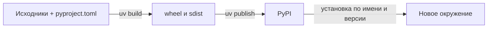

# Публикация пакета на PyPI

Публикация нужна для установки пакета из публичного индекса по имени.
Для сдачи можно передать исходники и wheel напрямую преподавателю.



Команды ниже — для macOS/Linux с Python 3.14 и uv. Выполняйте их из корня
своего проекта. Показан вариант публикации копии нашего `demo-project`
без runtime-зависимостей. Для своего пакета замените имя дистрибутива,
имя импорта и CLI на свои.

## 1. Выберите имя и версию

В примерах используется **`my-text-tools-your-login`**. Замените `your-login`
на свой идентификатор **во всех командах и конфигурации**. Проверьте доступность
имени на нужном сервисе; отсутствие страницы не гарантирует, что имя разрешено.

```toml
[project]
name = "my-text-tools-your-login"
version = "0.1.0"
```

Остальные поля `[project]` сохраните. Импортируемый пакет можно оставить
`text_tools`, а команду — `text-tools`: они не обязаны совпадать с именем
дистрибутива. В нашем примере путь `packages = ["src/text_tools"]` уже задан явно.

Обновите README: назначение, установка, API и CLI. Уберите относительные
ссылки на внешние файлы репозитория, недоступные читателю страницы PyPI,
либо замените их публичными URL. В архивы включайте только файлы проекта.
[Подготовка проекта к публикации](https://packaging.python.org/en/latest/tutorials/packaging-projects/).

## 2. Проверьте и соберите релиз

```bash
uv sync
uv run pytest
uv run ruff check .
uv run ruff format --check .
uv run mypy src
uv build --no-sources --out-dir dist/0.1.0
```

Ожидаются:

```text
dist/0.1.0/my_text_tools_your_login-0.1.0.tar.gz
dist/0.1.0/my_text_tools_your_login-0.1.0-py3-none-any.whl
```

Дефисы имени дистрибутива нормализуются в подчёркивания в именах архивов.
У пакета с бинарными расширениями теги wheel будут другими: используйте
фактическое имя файла. `--no-sources` отключает локальные подмены
`tool.uv.sources` при разрешении зависимостей сборки.
[Сборка и публикация uv](https://docs.astral.sh/uv/guides/package/).

Проверьте содержимое обоих архивов и
[установку wheel в отдельное окружение](wheel-check.md), подставив новые
имя и путь. Публикуйте оба файла одной проверенной сборки.

## 3. Подготовьте аккаунт PyPI

1. Зарегистрируйтесь на [PyPI](https://pypi.org/account/register/).
2. Подтвердите email, настройте двухфакторную аутентификацию.
3. В настройках аккаунта создайте API token для загрузки.
4. Для первой публикации нового проекта выберите область действия
   `Entire account`: проекта ещё нет в списке. После создания проекта
   используйте токен, ограниченный этим проектом, и отзовите первоначальный.

Токен даёт программе право публиковать от вашего имени. Не записывайте его
в README, TOML, Git или команду с буквальным значением токена.
Требования к аккаунтам и токенам описаны в
[справке PyPI](https://pypi.org/help/).

## 4. Опубликуйте на PyPI

Сначала проверьте список файлов без загрузки:

```bash
uv publish --dry-run --trusted-publishing never --publish-url https://upload.pypi.org/legacy/ dist/0.1.0/my_text_tools_your_login-0.1.0.tar.gz dist/0.1.0/my_text_tools_your_login-0.1.0-py3-none-any.whl
```

Затем введите токен скрытым вводом и выполните загрузку:

```bash
export UV_PUBLISH_TOKEN="$(python3 -c 'import getpass; print(getpass.getpass("PyPI token: "))')"
uv publish --trusted-publishing never --publish-url https://upload.pypi.org/legacy/ dist/0.1.0/my_text_tools_your_login-0.1.0.tar.gz dist/0.1.0/my_text_tools_your_login-0.1.0-py3-none-any.whl
unset UV_PUBLISH_TOKEN
```

Ввод токена не отображается. После ошибки загрузки также выполните
`unset UV_PUBLISH_TOKEN`. Для публикации используется API token,
а не пароль аккаунта. `--trusted-publishing never` выбирает ручную
аутентификацию вместо получения временных прав через CI.
Параметры описаны в [справочнике uv publish](https://docs.astral.sh/uv/reference/cli/#uv-publish).

Откройте `https://pypi.org/project/my-text-tools-your-login/0.1.0/`.
Проверьте имя, версию, README и список файлов: там должны быть wheel и sdist.

## 5. Установите пакет с PyPI

Для опубликованной копии нашего примера:

```bash
publish_project_dir="$PWD"
publish_check_dir="$(mktemp -d)"
uv venv --python 3.14 "$publish_check_dir/venv"
uv pip install --python "$publish_check_dir/venv/bin/python" --index-url https://pypi.org/simple/ "my-text-tools-your-login==0.1.0"
cd "$publish_check_dir"
"$publish_check_dir/venv/bin/python" -I -c "import text_tools; print(text_tools.__file__); print(text_tools.count_words('hello world'))"
"$publish_check_dir/venv/bin/text-tools" "hello world" --count
cd "$publish_project_dir"
```

Ожидается путь внутри нового `site-packages`, затем `2` и `2`.
Это установка из индекса по имени и версии, а не из локального архива.

Зависимости из метаданных пакета устанавливаются из PyPI автоматически.

| Операция | Адрес |
|---|---|
| Загрузка | `https://upload.pypi.org/legacy/` |
| Установка | `https://pypi.org/simple/` |

Адрес загрузки и адрес индекса — разные API.
[Upload API PyPI](https://docs.pypi.org/api/upload/).

## 6. Следующая версия

Если изменили опубликованный код, задайте новую версию, например `0.1.1`,
и повторите проверки, сборку и публикацию с новыми именами файлов.
Уже опубликованный файл нельзя заменить другим содержимым под тем же именем.
Удаление файла не освобождает его имя для повторной загрузки.
[Правила повторной загрузки](https://pypi.org/help/#file-name-reuse).

## Частые ошибки

| Ошибка | Что проверить |
|---|---|
| `403` / неверный токен | Токен от нужного сервиса, его область действия, права на проект |
| Имя недоступно | Выбрать другое имя дистрибутива, пересобрать файлы |
| Файл уже существует | Для изменённого содержимого поднять версию; при частичной загрузке проверить, какой из файлов отсутствует |
| Нет подходящей версии при установке | Индекс, имя, версия, время появления релиза и совместимость Python |
| После публикации по-прежнему импортируется `src` | Проверять новым Python вне папки проекта, без editable install |
